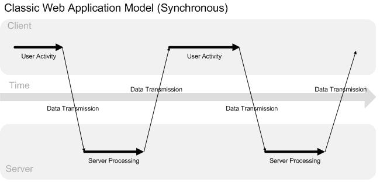
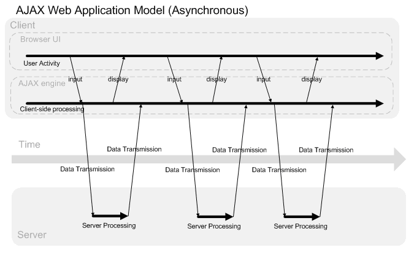
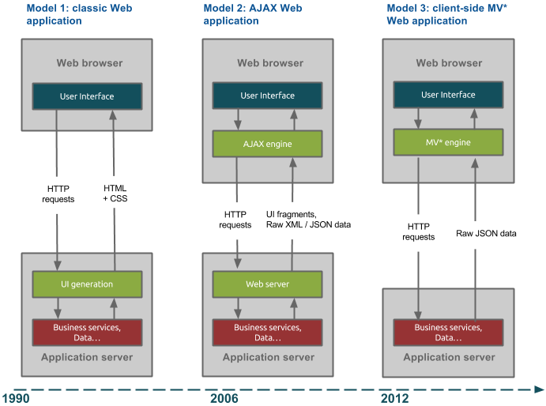

## JS в браузере


### Эволюция web-приложений: long time ago

 - Классическая схема web-приложения не содержит JS вовсе
 - (1) Браузер делает HTTP-запрос на сервер
 - (2) Сервер генерирует HTML + CSS для отображения в браузере
 - <span class="green">Pros:</span> простота, не требует JS
 - <span class="red">Cons:</span> в каждом ответе дублируется часть разметки (header, footer)
 - cервер отвечает за генерацию HTML (серверу это не нравится)




### Эволюция web-приложений: AJAX

 - Async Javascript and XML - технология общения с сервером без перезагрузки страницы
 - клиентский JS запрашивает отдельные данные или части страницы
 - <span class="green">Pros:</span><ul>
    <li>уменьшает нагрузку на сервер</li>
    <li>уменьшает передаваемый объем данных (при длительной работе)</li>
    <li>улучшает UI/UX ("отзывчивый интерфейс")</li>
    <li>может использовать любые методы и способы передачи данных HTTP</li>
 </ul>
 - <span class="red">Cons:</span><ul>
    <li>начальная загрузка страницы занимает больше времени</li>
    <li>код клиента и сервера усложняется</li>
    <li>код отображения разметки дублируется на сервере и клиенте</li>
 </ul>


### Эволюция web-приложений: AJAX




### Эволюция web-приложений: SPA

 - Single Page Application (SPA) - web-приложение, в котором вся логика генерации и отображения HTML содержится в JS
 - сервер отвечает только за хранение и обработку данных
 - страница никогда не перезагружается
 - данные передаются в формате JSON
 - <span class="green">Pros:</span> <ul>
    <li>сервер освобождается от задачи генерации HTML</li>
    <li>один сервер может работать с любыми клиентами</li>
    <li>наилучший UI/UX из возможных</li>
 </ul>
 - <span class="red">Cons:</span><ul>
    <li>проблемы с индексацией в поисковиках</li>
    <li>не работают с отключенным JS</li>
 </ul>


### Эволюция web-приложений




### XMLHttpRequest

<div class="flex"><div>
Синхронный запрос<br />
(не повторяйте этого дома!)
<pre><code class="javascript" data-trim data-noescape>
let xhr = new XMLHttpRequest();
xhr.open('GET', 'http://www.yoursite.com/',
    false);

// посылаем AJAX запрос
xhr.send();

// браузер висит и ждет ответа от сервера

// получили ответ от сервера
if (xhr.status === 200) {
    // запрос удачно завершен
    console.log(xhr.responseText);
} else {
    // обработка ошибки
}
</code></pre>
</div><div class="fragment">
Асинхронный запрос<br>
(а вот это повторяйте)
<pre><code class="javascript" data-trim data-noescape>
var xhr = new XMLHttpRequest();
xhr.open('GET', 'http://www.yoursite.com/',
    true);

// Cобытие изменения состояния запроса
xhr.addEventListener('readystatechange',
    function(e) {
    // интересует только завершенный запрос
    if (!xhr.readyState === 4) return;

    if(xhr.status === 200) {
        console.log(xhr.responseText);
    } else {
        // обработка ошибки
    }
});

// посылаем AJAX запрос
xhr.send();
</code></pre>
</div>
</div>


### События XMLHttpRequest
<table>
    <tr>
        <td>Действие</td>
        <td>Событие</td>
        <td>xhr.readyState</td>
    </tr>
    <tr>
        <td>XMLHttpRequest создан</td>
        <td> - </td>
        <td>0</td>
    </tr>
    <tr>
        <td>Вызов xhr.open()</td>
        <td> - </td>
        <td>1</td>
    </tr>
    <tr>
        <td>Вызов xhr.send()</td>
        <td>loadstart</td>
        <td>1</td>
    </tr>
    <tr>
        <td>Получены заголовки ответа</td>
        <td> - </td>
        <td>2</td>
    </tr>
    <tr>
        <td>Получен пакет данных</td>
        <td>progress</td>
        <td>3</td>
    </tr>
    <tr>
        <td>Ошибка</td>
        <td>abort, error, timeout</td>
        <td>4, xhr.status !== 200</td>
    </tr>
    <tr>
        <td>Успешный запрос</td>
        <td>load</td>
        <td>4, xhr.status === 200</td>
    </tr>
    <tr>
        <td>Запрос завершен</td>
        <td>loadend</td>
        <td>4</td>
    </tr>
</table>


### XMLHttpRequest API
<table>
    <tr>
        <td>`xhr.open(method, url, async)`</td>
        <td>Создание нового XMLHttpRequest</td>
    </tr>
    <tr>
        <td>`xhr.setRequestHeader(name, data)`</td>
        <td>Установка заголовков запроса</td>
    </tr>
    <tr>
        <td>`xhr.send([body])`</td>
        <td>Посылка AJAX-запроса</td>
    </tr>
    <tr>
        <td>`xhr.readyState`</td>
        <td>Статус объекта XHR</td>
    </tr>
    <tr>
        <td>`xhr.status/statusText`</td>
        <td>Статус ответа сервера</td>
    </tr>
    <tr>
        <td>`xhr.responseText/responseXML`</td>
        <td>Ответ сервера, строка/DOM-документ</td>
    </tr>
    <tr>
        <td>`xhr.responseType`</td>
        <td>Ожидаемый тип данных (text|json|document|blob etc.)</td>
    </tr>
    <tr>
        <td>`xhr.response`</td>
        <td>Ответ сервера с учетом responseType</td>
    </tr>
</table>


### Отправка данных

 - HTTP - текстовый протокол, и мы можем вручную задать все части запроса
 - HTTP позволяет отправлять данные в URL (query string) и в теле запроса

```HTTP
POST /path/script.cgi?key1=value1&key2=value2 HTTP/2.0
Host: mysite.com
. . .
Content-Type: application/x-www-form-urlencoded
Content-Length: 23

key3=value3&key4=value4

```


### Отправка данных в query string
 - данные в query string должны быть закодированы через urlencoded
 - urlencoded: строка вида `'key1=value1&key2=value2&...'`
 - всё кроме латинских букв и некоторых спецсимволов заменяется на цифровой код в UTF-8 со знаком %

```javascript
var params = 'param1=' + encodeURIComponent(value1) + '&'
             'param2=' + encodeURIComponent(value2);
xhr.open('GET', 'http://tinyurl.com/4poyc6x?' + params, true);
// http://tinyurl.com/4poyc6x?param1=%D0%A6%20%D0%A6&param2=hello
```


### Отправка данных в теле запроса

 - отправить данные в теле запроса можно в любой кодировке
 - однако лучше использовать одну из стандартных:

`application/x-www-form-urlencoded`

```HTTP
Content-Type: application/x-www-form-urlencoded

foo=bar&baz=The+first+line.%0D%0AThe+second+line.%0D%0A
```

`text/plain`

```HTTP
Content-Type: text/plain

foo=bar
baz=The first line.
The second line.
```


### Отправка данных в теле запроса

 `multipart/form-data`

```HTTP
Content-Type: multipart/form-data; boundary=---------------------------314911788813839

-----------------------------314911788813839
Content-Disposition: form-data; name="foo"

bar
-----------------------------314911788813839
Content-Disposition: form-data; name="baz"

The first line.
The second line.

-----------------------------314911788813839--
```

```javascript
let formData = new FormData(), xhr = new XMLHttpRequest();

formData.append("username", "Groucho");
formData.append("accountnum", 123456); // коневертируется в строку
// Выбранный пользователем файл из input type="file"
formData.append("userfile", fileInputElement.files[0]);

xhr.open("POST", "http://foo.com/submitform.php");
xhr.send(formData); // multipart/
```


### `FormData`

 - API, позволяющий добавлять пары "ключ-значение" и передать их в XHR
 - может содержать файлы и объекты Blob (JS-строка с mime-типом)
 - при передаче в XHR данные автоматически кодируются как `multipart/form-data`
 - `FormData` также может принять аргументом обычную HTML-форму

```javascript
let formElement = document.querySelector("form"),
    xhr = new XMLHttpRequest(),
    form = new FormData(formElement);

let content = '<a id="a"><b id="b">hey!</b></a>',
    blob = new Blob([content], { type: "text/xml"});
form.append("webmasterfile", blob);

xhr.open("POST", "submitform.php");
xhr.send(form);
```


### Отправка данных в теле запроса

 `application/json`

```HTTP
Content-Type: application/json;

{"key1":"value1","key2":"value2","number1":1234,"arr":[1,2,"a"]}
```

```javascript
var xhr = new XMLHttpRequest();
xhr.open("POST", "/json-handler");
xhr.setRequestHeader("Content-Type", "application/json");

xhr.send('{"key1":"value1","key2":"value2","number1":1234,"arr":[1,2,"a"]}');
```


### Формат JSON
<ul>
    <li>Предназначен для передачи и хранения данных</li>
    <li>Содержит минимально необходимый набор типов данных:
        <ul>
            <li>JS-объект (ключ-значение); ключи обязательно в двойных кавычках</li>
            <li>JS-массив</li>
            <li>строки в двойных кавычках | числа | `true` | `false` | `null`</li>
        </ul>
    </li>
    <li>`JSON.stringify(JSON [, replacer])` - преобразует JS-объект в строку
        <ul>
            <li>При сериализации объекта пытается вызвать его метод toJSON</li>
            <li>`replacer` - фильтр полей для сериализации; массив|функция</li>
        </ul>
    <li>`JSON.parse(JSONString [, reviver])` - извлекает JS-данные из строки</li>
</ul>

```javascript
let obj = {a: 1, b: 2, c: 3},
    xhr = new XmlHttpRequest();

xhr.open("POST", "/json-handler");
xhr.setRequestHeader("Content-Type", "application/json");

xhr.send(JSON.serialize(obj));

```


### Непрерывное получение данных (COMET)
<ul>
    <li class="fragment">Polling (частые опросы)
        <ul>
            <li>Клиент посылает запросы обновлений с некоторой периодичностью</li>
            <li>Задержка между возникновением события и его отправкой</li>
            <li><span class="green">Pros:</span> Простота реализации</li>
            <li><span class="red">Cons:</span> Дополнительная нагрузка на сервер</li>
        </ul>
    </li>
    <li class="fragment">Long polling (длинные опросы)
        <ul>
            <li>Клиент посылает запрос обновлений, который не закрывается до тех пор, пока не возникнут обновления;
            после получения обновлений клиент сразу же открывает новый запрос</li>
            <li><span class="green">Pros:</span> Как только появляются данные, происходит их отправка</li>
            <li><span class="red">Cons:</span> Сервер должен уметь работать с большим числом "висящих" соединений</li>
        </ul>
    </li>
</ul>


### Websockets

 - Протокол, работающий над HTTP; требует специальной поддержки сервером
 - События: `open`, `close`, `message`, `error`

```javascript
let socket = new WebSocket("ws://javascript.ru/ws");
socket.onmessage = function(event) {
    console.log(event.data);
}
socket.send('hello');
```


### `sessionStorage`/`localStorage`

 - Позволяют хранить данные в виде "ключ-значение"
 - `sessionStorage` очищается при завершении сессии
 - `localStorage` хранит данные постоянно
 - `Storage`: `length`, `setItem`, `getItem`, `removeItem`, `clear`
 - можно хранить только строки

```javascript
localStorage.setItem('userSettings', JSON.serialize(userSettings));
```