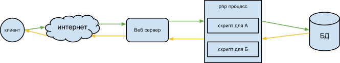
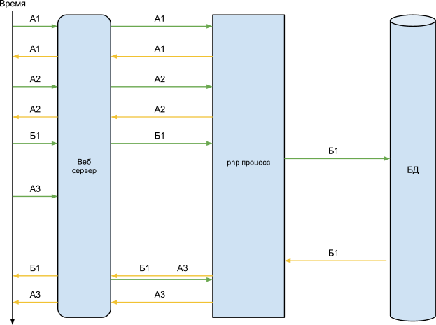
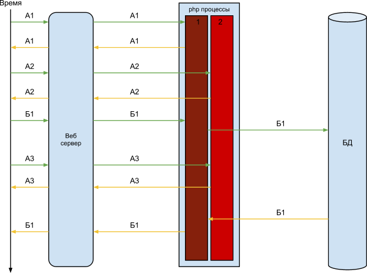
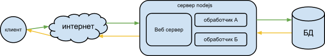
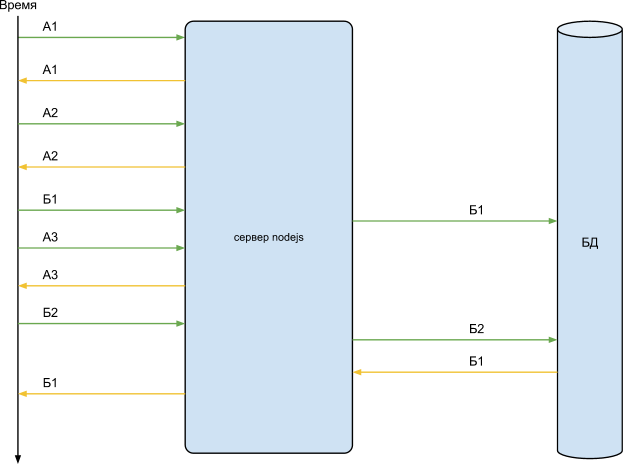

## Node.js


### What is this all about?

 - Node.js - среда выполнения JS, работающая вне браузера
 - создана Ryan Dahl (Райан Дал) в 2009
 - на основе движка V8 (Google) + I/O + модули

<ul>
    <li>JavaScript</li>
    <li>Общий код и "экосистема" на клиенте и сервере</li>
    <li>Создана для решения задач под Web</li>
    <li>Легко поддерживает множество HTTP соединений</li>
    <li>NPM - пакетный менеджер + база готовых модулей</li>
</ul>


### Из чего состоит JS в Node.js?

 - Имя глобального объекта JS в node.js - `global`
 - (1) Глобальные объекты ядра JS: `Number`, `parseInt`, etc
 - (2) Глобальные объекты Node.js: `console`, `module`, `process`, `setTimeout` etc.
 - (3) Библиотека модулей Node.js: <ul>
   <li>`fs` - файловая система</li>
   <li>`http` - работа с HTTP (как сервер, так и клиент)</li>
   <li>`events` - работа с событиями</li>
   <li>`net` - работа с сетью на низком уровне</li>
   <li>`url` - работа с URL (парсинг/создание)</li>
   <li>`os` - сведения об ОС</li>
   <li>etc., etc., etc. + пользовательские модули</li>
</ul>


### Модули

 - программа на Node.js состоит из отдельных файлов-модулей
 - модуль - обособленный участок функционала, подключаемый с помощью `require()`
 - переменные, объявленные внутри модуля, являются приватными
 - глобальные переменные нужно явно создавать как `global.varName`
 - любое внешнее API или данные должны быть явным образом экспортированы из модуля с помощью `module.exports`


### Экспорт значений (`module.exports`)

 - при загрузке модуля `require()` вначале выполняет его код
 - затем `require()` использует значение из `module.exports` как результат работы модуля
 - в начале работы модуля `module.exports` - пустой объект

```javascript
// circle.js
const PI = Math.PI;
module.exports.area = (r) => PI * r * r;
module.exports.circumference = (r) => 2 * PI * r;

// index.js
const circle = require('./circle.js')
console.log( `The area of a circle of radius 4 is ${circle.area(4)}`);
```


### Экспорт значений (`module.exports`)

 - `exports` - синоним для `module.exports`
 - можно присваивать значения свойствам `exports`, но не самой `exports`
 - `require()` кэширует единожды загруженные модули
 - отложенное присвоение в `exports/module.exports` не работает

```javascript
const EventEmitter = require('events');
module.exports = new EventEmitter();
module.exports.x = 15;
exports.y = 20;

// разрывает связь между module.exports и exports
exports = new EventEmitter();

// и это тоже не сработает из-за кэширования
setImmediate(() => {
    module.exports.myVar = 1;
});
```


### Объект `module`

 - объект `module` описывает текущий модуль
 - `module.exports` - экспортируемые модулем значения
 - `module.children` - все модули, запрошенные текущим модулем
 - `module.parent` - ссылка на модуль, впервые запросивший текущий
 - `module.filename` - путь к файлу модуля
 - `module.loaded` - загружен ли модуль


### Файлы-модули

 - каждый js/json файл считается отдельным модулем
 - `require()` сначала пытается найти в системе именно файлы-модули
 - вначале ищется точное имя файла, затем имя + `.js/.json/.node`
 - если нет префиксов `/, ./, ../` - то ищется модуль ядра, или модуль из `node_modules`
 - файлы `json` сразу же возращаются как JS объекты

```javascript
require('./test.js');    // файл test.js в текущей директории
require('./test');       // файл test.js | test.json | test.node
require('../test.json'); // файл test.json в родительской директории
require('test');         // модуль ядра или npm-модуль c именем test
```


### Директории-модули

 - для выделения в модуль большого пласта функционала используют директории с одной точкой входа
 - `package.json` - JSON с описанием модуля и точки входа в модуль
 - если в директории нет файла `package.json`, то `require` пытается найти файл `index.js/.json/.node`

```JSON
{
    "name" : "foo",
    "version" : "1.2.3",
    "description" : "A packaged foo fooer for fooing foos",
    "main" : "foo.js",
    "man" : "./man/doc.1"
}
```


### Пакетный менеджер NPM
 - работает из командной строки
 - открывает доступ к огромному репозиторию готовых модулей
 - скачивает код модуля и все его зависимости в папку `node_modules`
 - затем модули NPM можно подключать с помощью `require`
 - `npm install <pkg-name>` - скачать и установить модуль
 - `npm uninstall <pkg-name>` - удалить пакет
 - `npm install -g <pkg-name>` - скачать и установить модуль глобально


### Работа с NPM и `package.json`

 - Любой Node.js проект содержит файл `package.json`
 - NPM может использовать информацию из этого файла
 - это позволяет управлять зависимостями проекта и запуском скриптов
 - `npm install --save <pkg-name>` - установить пакет и записать его в секцию `dependencies`
 - `npm install --save-dev <pkg-name>` - установить пакет и записать его в секцию `devDependencies`
 - `npm install` - установить все зависимости из `[dev]Dependencies`
 - `npm install --production` - установить зависимости из `dependencies`
 - `npm run <script-name>` - запустить команду из секции `scripts`


### (псевдо)глобальные объекты и функции

 - `require()` - подключение модуля
 - `module` - ссылка на текущий модуль
 - `exports` - shortcut для `module.exports`
 - `__dirname` - директория текущего файла (модуля)
 - `__filename` - имя текущего файла (модуля)
 - `process` - процесс ОС
 - `setTimeout`/`setInterval`/`setImmediate` - таймеры
 - `console` - объект консоли

```javascript
let os = require('os');

console.log(os.platform()); // 'linux'
console.log(__filename);     // 'test.js'
```


### `global.process`

 - Каждое node.js приложение - экземпляр класса Process
 - Информация о процессе: `version`, `platform`, `arch`, `pid`
 - `process.argv` - агрументы командной строки
 - `process.env`: переменные окружения
 - `process.exit(code)` - выход из приложения
 - `process.memoryUsage()` - потребление памяти
 - `process.nextTick()` - аналог `setTimeout(fn, 0)`


### Event loop

 - Node.js исполняет JS код в одном потоке
 - однако все I/O операции выполняются в других потоках, не блокируя основной
 - Event loop: <ul>
   <li>Выполняются функции, установленные с помощью process.nextTick()</li>
   <li>Выполняются коллбеки, не имеющие отношения к I/O (таймеры, etc.)</li>
   <li>Выполняются коллбеки, вызванные I/O операциями</li>
</ul>
 - любые I/O операции завершаются вызовом JS-callback функции
 - некоторые операции имеют синхронные аналоги


### Event loop


### Node.js vs PHP/Python/Ruby

 
 


### Node.js vs PHP/Python/Ruby




### Node.js vs PHP/Python/Ruby





### События

 - все модули, желающие использовать события, используют модуль `events`
 - при наступлении события *синхронно* вызываются все его обработчики в порядке добавления

```javascript
const EventEmitter = require('events'),
    myEmitter = new EventEmitter();

myEmitter.on('event', (a, b) => {
  console.log(`an event occurred: ${a}, ${b}`);
});

myEmitter.on('event', (a, b) => {
  setImmediate(() => {
    console.log('this happens asynchronously');
  });
});

myEmitter.emit('event', 1, 2);
```


### `EventEmitter`
 - `addListener/on(event, fn)` - добавить обработчик события
 - `once(event, fn)` - обработчик будет вызван только один раз
 - `listeners(event)` - список обработчиков событий
 - `removeListener(event, fn)` - удалить обработчик
 - `emit(event [, args])` - вызвать событие


### Web-сервер на Node.js

```javascript
let http = require('http');

let server = http.createServer(function (request, response)
    console.log("HTTP works!");
    response.writeHead(200, ('Content-Тype': 'text/html'});
    response.end('<hl>Hello!</hl>');
});

server.listen(8080);
```


### HTTP запрос (`http.IncomingMesage`)</h2>

 - `headers` - массив заголовков
 - `rawHeaders` - массив заголовков в виде строки
 - `method` - метод HTTP
 - `url` - query string запроса

```javascript
let http = require('http'),
    url = require('url'),
    server = new http.Server();

server.addListener('request', (req, res) => {
    let queryObject = url.parse(req.url, true).query;
    console.log(queryObject);
    ...
});

server.listen(8080);
```


### HTTP ответ (`http.ServerResponse`)

 - `setHeader(name, value)` - установить заголовок HTTP
 - `statusCode`, `statusMessage` - статус ответа
 - `writeHead(statusCode[, statusMessage][, headers])` - отправить заголовки
 - `write(chunk[, encoding][, callback])` - отправить часть тела ответа
 - `end([data][, encoding][, callback])` - отправить body и завершить ответ


### Веб-сервер статических данных
<div class="flex">
<pre style="width: 30%"><code data-trim data-noescape class="javascript">
var http = require("http"),
fs = require("fs"),
url = require("url"),
path = require("path");

var mimeTypes = {
  '.js':   'text/javascript',
  '.html': 'text/html',
  '.css':  'text/css',
  '.jpg':  'image/jpeg',
  '.gif':  'image/gif'
);
</code></pre>

<pre style="width: 70%"><code data-trim style="max-height: none;" class="javascript">
http.createServer(function (request, response) {
    let pathname = url.parse(request.url).path;
    if (pathname === "/") pathname = "/index.html";
    pathname = pathname.substring(l}; // обрезать слэш в начале

    let extname = path.extname(pathname),
        mimeType = mimeTypes(extname),
        encoding = (extname === ".gif"} || (extname === ".jpg")
            ? 'binary' : 'utf8';

    fs.readFile(pathname, encoding, function(err, data) {
        response.writeHead(200, ('Content-Type': mimeType ));
        response.end(data, encoding);
    });
}).listen(8080);
</code></pre>
</div>


### Фреймворк Connect

 - Connect представляет обработку запроса как серию преобразований
 - каждое преобразование - это функция ("middleware")
 - интегрирует множество возможностей по работе с веб-сервером

<div class="flex">
<pre style="width: 39%;"><code data-trim data-noescape class="javascript">
let connect = require('connect'),
    http = require('http');

let арр = connect()
    .use(function(req, res, next) {
        console.log("1");
        next();
    )).use(function(req, res, next) {
        console.log("2");
        next();
    }).use(function(req, res, next} (
        console.log("3");
        res.end("hello connect!");
    }};
http.createServer(app).listen(8080);
</code></pre>
<pre style="width: 59%;" class="fragment"><code data-trim data-noescape style="max-height: none;" class="javascript">
let connect = require('connect'),
    http = require('http'),
    serveFavicon = require('serve-favicon'),
    serveStatic = require('serve-static');

let арр = connect()
    .use(serveFavicon(\`${\_\_dirname}/favicon.ico\`))
    .use(serveStatic(\`${\_\_dirname}/public\`))
    .use('/foo', function(req, res, next) {
        // req.url starts from /foo
        res.end('This is foo page!');
    })
    .use('/bar', function(req, res, next) {
        // req.url starts from /bar
        res.end('This is bar page!');
    });
http.createServer(арр).listen(8080);
</code></pre>
</div>


### Фреймворк Express

 - Connect все же недостаточно высокоуровневый
 - Express добавляет возможности роутинга: подписки на определенные url и методы запроса

```javascript
app.post('/', function (req, res, next) {
    res.send('Got a POST request');
});

app.put('/user', function (req, res) {
    res.send('Got a PUT request at /user');
});

app.get('/user/:id', function(req, res) {
    res.send('user ' + req.params.id);
});
```
