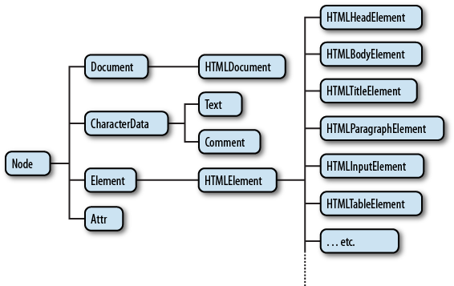

## JS в браузере


### Из чего состоит JS на web-страничке?

 - Имя глобального объекта JS в браузере - `window`
 - (1) Глобальные объекты ядра JS: `Number`, `parseInt`, etc
 - (2) `document` - модель HTML-страницы: Document Object Model (DOM)
 - (3) Другие "подсистемы" браузера - Browser Object Model (BOM)<ul>
    <li>`navigator` - сведения о браузере</li>
    <li>`XMLHttpRequest/fetch` - асинхронные HTTP-запросы (AJAX)</li>
    <li>`location`, `history` - адресная строка и навигация</li>
    <li>`localStorage/sessionStorage` - хранение данных</li>
    <li>`Worker()` - выполнение работы в фоновом режиме</li>
    <li>`Notification()` - нотификации</li>
    <li>`navigator.geolocation` - геолокоция</li>
    <li>etc, etc, etc</li>
 </ul>


### Как добавить JS-код на web-страницу?
 - Отдельный файл с кодом:
```html
<script type="javascript" src="path/to/file.js"></script>
```
 - JS-код внутри тегов script
```html
<script type="javascript">[JS-код]</script>
```
 - JS-код внутри HTML-атрибутов для обработчиков событий
```html
<input type="text" onclick="[JS-код]">
```
 - URL-адрес, содержащий спецификатор псевдопротокола `javascript:`
```html
<a href="javascript:[JS-код]">link title</a>
```


### Какой из способов добавить JS лучше всех?

```html
<script type="javascript" src="path/to/file.js"></script>
```

 - Разделение кода и представления
 - Повторное использование JS кода
 - Кэширование JS-кода
 - Возможность запустить код не только в браузере
 - Возможность указать URL с другого сайта


### Очередность загрузки и выполнения программы

 - (1 этап) Загрузка и выполнение кода в `<script></script>`<ul>
    <li>Все файлы скачиваются параллельно и выполняются в порядке следования</li>
    <li>Код в каждом скрипте выполняется последовательно</li>
    <li>Рендеринг страницы при этом блокируется</li>
    <li>`<script src="..." async>` - скрипт выполнится как только загрузится</li>
    <li>`<script src="..." defer>` - скрипты выполятся в порядке следования после окончания рендера страницы</li>
 </ul>
 - (2 этап): Асинхронный и управляемый событиями <ul>
    <li>Браузер вызывает ранее объявленные обработчики в ответ на возникающие события</li>


### Document Object Model (DOM)
 - DOM - представление страницы в виде дерева узлов (DOM Node Tree)
 - каждый тег, текст, комментарий, doctype и сам документ - это узел DOM
 - любой узел DOM - объект определенного класса с методами и свойствами
 - манипулируя объектами DOM из JS, можно изменять документ в браузере




### Структура DOM-дерева

<div class="flex">
<pre><code data-trim class="html">
&lt;html&gt;
    &lt;head&gt;
        &lt;title&gt;Sample Document&lt;/title&gt;
    &lt;/head&gt;
    &lt;body&gt;
        &lt;p&gt;
            This is a &lt;i&gt;simple&lt;/i&gt; document.
            &lt;!-- This is a comment --&gt;
        &lt;/p&gt;
    &lt;/body&gt;
&lt;/html&gt;
</code></pre>
<div>
    
</div>
</div>


### DOM-дерево с текстовыми узлами и комментариями


### Навигация по DOM-дереву

<div class="flex">
    
    
</div>

 - Descendants - узлы, лежащие внутри данного
 - Children - узлы-непосредственные потомки данного
 - Siblings - узлы, лежащие на одном уровне с данным
 - `childNodes` - array-like свойство, коллекция узлов (класс NodeList)
 - В случае отсутствия узла ссылка указывает на null


### Навигация по DOM-дереву

```html
<html>
    <head>
        <title>Sample Document</title>
    </head>
    <body>
        <p>
            This is a <i>simple</i> document.
            <!-- This is a comment -->
        </p>
    </body>
</html>
```

```javascript
let p = window.document.querySelector('p'); // HTMLParagraphElement (<p> tag)
p.parentNode;      // HTMLBodyElement (<body> tag)

p.previousSibling;             // Text
p.previousSibling.nodeName;    // '#text'
p.previousSibling.nodeType;    // 3
p.previousSibling.textContent; // '↵␣␣␣␣'

p.nextSibling;     // Text ('↵↵')
p.firstChild;      // Text ('↵␣␣␣␣␣␣␣␣This is a␣')
p.lastChild;       // Text ('↵␣␣␣␣')
p.childNodes;      // NodeList [Text, HTMLElement (<i>), Text, Comment, Text]
```


### Навигация по элементам DOM-дерева (без текстовых узлов)


 - `parentNode/parentElement` отличаются только для самых верхних элементов (`<html>` и `doctype`):
 - `document.documentElement.parentNode` => `document`
 - `document.documentElement.parentElement` => `null`
 - `children` - array-like свойство (класс `HTMLCollection`)</li>


### Навигация по DOM-дереву без текстовых узлов

```html
<!doctype html>
<html>
    <head>
        <title>Sample Document</title>
    </head>
    <body>
        <p>
            This is a <i>simple</i> document.
            <!-- This is a comment -->
        </p>
    </body>
</html>
```

```javascript
let p = window.document.querySelector('p'); // HTMLParagraphElement (<p> tag)
p.parentElement;      // HTMLBodyElement (<body> tag)

p.previousElementSibling; // null
p.nextElementSibling;     // null
p.firstElementChild;      // HTMLElement (<i> tag)
p.lastElementChild;       // HTMLElement (<i> tag)
p.children;               // HTMLCollection [ i ]

p.parentElement.previousElementSibling; // HTMLHeadElement (<head> tag)

document.childNodes;         // NodeList [DocumentType, HTMLHtmlElement]
document.children;           // HTMLCollection [HTMLHtmlElement]
```


### Поиск в DOM-дереве

<table>
    <thead>
        <tr>
            <th>Метод</th>
            <th>Ищет по..</th>
            <th>Контекст?</th>
            <th>Возвращает</th>
        </tr>
    </thead>
    <tbody>
        <tr>
            <td><code>getElementById</code></td>
            <td>id attr</td>
            <td> - </td>
            <td>Element/null</td>
        </tr>
        <tr>
            <td><code>getElementsByName</code></td>
            <td>name attr</td>
            <td> - </td>
            <td>live collection</td>
        </tr>
        <tr>
            <td><code>getElementsByTagName</code></td>
            <td>имя тега</td>
            <td> ✔ </td>
            <td>live collection</td>
        </tr>
        <tr>
            <td><code>getElementsByClassName</code></td>
            <td>class attr</td>
            <td> ✔ </td>
            <td>live collection</td>
        </tr>
    </tbody>
</table>

<div class="flex fragment">
<pre style="width: 40%"><code class="html" data-trim>
<ul class="list">
  <li id="my-id">
    <p>1</p>
  </li>

  <li>
    <p name="my-p">2</p>
  </li>

  <li class="list">
    <p>3</p>
  </li>
</ul>
</code></pre>

<pre style="width: 59%"><code class="javascript" data-trim>
document.getElementById('my-id');      // HTMLLIElement
document.getElementsByName('my-p');  // NodeList [1]
document.getElementsByName('no-name'); // NodeList [0]
document.getElementsByTagName('p');    // HTMLCollection [3]
let li = document.getElementById('my-id');
li.getElementsByTagName('p');          // HTMLCollection [1]

let clt = document.getElementsByClassName("list");
for (let el of clt) console.log(el.tagName); // 'UL' 'LI'

document.body.children[0].children[2].remove();
clt.length; // 1 (!)
</code></pre>
</div>


### Поиск по CSS селектору

<table>
    <thead>
        <tr>
            <th>Метод</th>
            <th>Ищет по..</th>
            <th>Контекст?</th>
            <th>Возвращает</th>
        </tr>
    </thead>
    <tbody>
        <tr>
            <td><code>querySelector</code></td>
            <td>CSS селектор</td>
            <td> ✔ </td>
            <td>Element/null</td>
        </tr>
        <tr>
            <td><code>querySelectorAll</code></td>
            <td>CSS селектор</td>
            <td> ✔ </td>
            <td>static collection</td>
        </tr>
        <tr>
            <td><code>closest</code></td>
            <td>CSS селектор</td>
            <td> ✔ </td>
            <td>Element/null</td>
        </tr>
    </tbody>
</table>

<div class="flex fragment">
<pre style="width: 40%"><code class="html" data-trim>
<ul class="list">
  <li id="my-id">
    <p>1</p>
  </li>

  <li>
    <p name="my-p">2</p>
  </li>

  <li class="list">
    <p>3</p>
  </li>
</ul>
<p>finish</p>
</code></pre>
<pre style="width: 60%"><code class="javascript" data-trim>
document.querySelector('ul li#my-id p').textContent;  // '1'
document.querySelector('p[name="my-p"]').textContent; // '2'
document.querySelector('li.list p').textContent;      // '3'

for (el of document.querySelectorAll('li p'))
    console.log(el.textContent); // '1', '2', '3'

let li = document.querySelector('li.list');
let p = li.querySelector('ul p'); // HTMLParagraphElement (!)
p.textContent;  // '3'

p.closest('.list');  // HTMLLIElement (li.list)
</code></pre>
</div>


### Поиск в DOM-дереве: особенности

 - На практике нет разницы между `NodeList` и `HTMLCollection`: <ul>
    <li>Оба типа имеют свойство `length` (перебор через `for (...)`)</li>
    <li>Оба типа имеют default итератор (перебор значений через `for ... of`)</li>
 </ul>
 - "Live" коллекции изменяются автоматически при изменении DOM-дерева
 - "Static" коллекции обладают более привычным поведением
 - `querySelector` и `querySelectorAll` ищут во всем документе, а затем отбрасывают все элементы, находящиеся вне контекста


### Свойства узлов DOM

 - `nodeType` - тип узла (`ELEMENT_NODE` = 1, `TEXT_NODE` = 3 etc)
 - `nodeName` - имя тега для Element, описание узла для других типов (`'#text'`, `'#comment'` etc)
 - `tagName` - имя тега для Element, и отсутствует для остальных
 - `innerHTML` - HTML-содержимое элемента в виде строки
 - `outerHTML` - HTML-содержимое, включая обрамляющие теги
 - `data` - содержимое узлов - не-элементов
 - `textContent` - конкатенация текста во внутренних узлах элемента
 - `value`, `id`, `href` etc-etc-etc - зависит от типа узла


### Свойства узлов DOM

```html
<ul>
  <li>first</li>
  <li>second</li>
  <li>third</li>
</ul>
```
```javascript
let ul = document.querySelector('ul'),
    li = ul.children[1],
    txt = li.childNodes[0];
```

<div class="flex">
<pre style="width: 32%"><code class="javascript" data-trim>
ul.nodeType;    // 1
ul.nodeName;    // 'UL'
ul.tagName;     // 'UL'
ul.data;        // undefined
ul.textContent;
// '↵␣␣first↵␣␣second↵␣␣third↵'
ul.innerHTML;
// '↵␣␣<li>first ... third</li>↵'
ul.outerHTML;
// '<ul>↵␣␣ ... </li>↵</ul>'
</code></pre>
<pre style="width: 32%"><code class="javascript" data-trim>
li.nodeType;    // 1
li.nodeName;    // 'LI'
li.tagName;     // 'LI'
li.data;        // undefined
li.textContent; // 'second'

li.innerHTML; //'second'

li.outerHTML; //'<li>second</li>'
</code></pre>
<pre style="width: 32%"><code class="javascript" data-trim>
txt.nodeType;    // 3
txt.nodeName;    // '#text'
txt.tagName;     // undefined
txt.data;        // 'second'
txt.textContent; // 'second'

txt.innerHTML;   // undefined

txt.outerHTML;   // undefined
</code></pre>
</div>


### Атрибуты и свойства DOM-объектов

 - Атрибуты HTML и свойства DOM-объектов часто, (но не всегда!) отображаются друг в друга
 - Свойства DOM-объектов - это обычные свойства JS
 - Атрибуты HTML - то что записано атрибутом элемента в тексте HTML

<table class="fragment">
    <thead>
        <tr>
            <th></th>
            <th>Properties</th>
            <th>Attributes</th>
        </tr>
    </thead>
    <tbody>
        <tr>
            <td>Тип данных</td>
            <td>Любой</td>
            <td>Строка</td>
        </tr>
        <tr>
            <td>Case</td>
            <td>sensitive</td>
            <td>insensitive</td>
        </tr>
        <tr>
            <td>innerHTML</td>
            <td>не видны</td>
            <td>видны</td>
        </tr>
        <tr>
            <td>Как работать</td>
            <td style="width: 40%">
<pre><code class="javascript" data-trim>
prop in elem;
elem.prop;
elem.prop = value;
delete elem.prop;
</code></pre>
            </td>
            <td style="width: 40%">
<pre><code class="javascript" data-trim>
elem.hasAttribute(attr);
elem.getAttribute(attr);
elem.setAttribute(attr, value);
elem.removeAttribute(attr);
</code></pre>
            </td>
        </tr>
    </tbody>
</table>


### Props & attrs: исключений больше чем правил

 - Большинство стандартных атрибутов HTML становятся свойствами DOM
 - Нестандартные атрибуты не становятся свойствами
 - `id`: свойство <=> атрибут (меняет атрибут и наоборот)
 - `href`: свойство <=> атрибут, но свойство должно быть полной ссылкой
 - `checked`: свойство может быть `true/false`, в атрибуте важно только его наличие; атрибут устанавливает только начальное значение свойства
 - `class` <=> свойство `className` (`for <=> htmlFor`)
 - `class` <=> объект `classList` (`add/remove/toggle/contains`)


### Props & attrs: исключений больше чем правил

```html
<input type="checkbox" class="my-class" myAttribute="myValue" checked />
```

```javascript
let input = document.querySelector('input');
input.className;  // 'my-class'
input.type;       // 'checkbox'
input.checked;    // true

input.myAttribute;                 // undefined
input.getAttribute('myAttribute'); // 'myValue'

input.checked = false;         // галочка снята
input.hasAttribute('checked'); // true, связь между атрибутом и свойством разорвана

[...input.classList];                   // ['my-class']
input.classList.add('my-class-2');
input.className;                        // 'my-class my-class-2'
input.classList.toggle('my-class');
[...input.classList];                   // ['my-class-2']
input.classList.contains('my-class-2'); // true
```


### data-атрибуты

 - Атрибуты вида data-* зарезервированы в HTML5 для нужд пользователя
 - Ими можно управлять из JS с помощью свойства `dataset`
 - Преобразование имен: `data-attr-name` <=> `el.dataset.attrName`
 - Можно хранить только строки

```html
<div id="elem" data-order-id="123" data-order-name="pizza"></div>
```
```javascript
let div = document.getElementById('elem');
div.dataset.orderId;       // => "123"
div.dataset.orderId = 999; // изменили значение свойства/атрибута
div.dataset.orderName;     // => "pizza"
```


### Изменение структуры DOM-дерева

 - `document.createElement(tagName)` - создать новый элемент
 - `document.createTextNode(text)` - создать новый текстовый узел
 - `root.appendChild(node)` - добавить узел в конец потомков `root`
 - `root.replaceChild(newNode, oldNode)` - заместить узел другим
 - `root.removeChild(node)` - удалить узел
 - `node.remove()` - удалить без ссылки на родительский элемент
 - `node.cloneNode(deep)` - клонировать узел (deep/shallow)
 - `root.insertBefore(node, nextNode)` - добавить узел в список потомков `root` перед `nextNode`


### Изменение структуры DOM-дерева

```html
<ul id="list">
    <li>0</li>
    <li>1</li>
    <li>2</li>
</ul>
```

```javascript
let ul = document.getElementById('list'),
    li, txt;

li = document.createElement('li');
txt = document.createTextNode('-1');
li.appendChild(txt);                 // создали li с текстом -1
ul.insertBefore(li, ul.children[0]); // добавили его в начало списка

li = li.cloneNode(false);
li.innerHTML = '4';
ul.appendChild(li); // вставили li с текстом 4 в конец
ul.replaceChild(li, ul.children[1]); // удалили второй li и вставили на ее место последний
```


### Оптимизация работы с DOM

<div class="flex">
<pre><code class="javascript" data-trim>
let ul = document.createElement('ul');
document.body.appendChild(ul);
for (...) ul.appendChild(li);
</code></pre>
<pre><code class="javascript" data-trim>
let ul = document.createElement('ul');
for(...) ul.appendChild(li);
document.body.appendChild(ul);
</code></pre>
</div>

<ul class="fragment">
    <li>поочередная вставка элементов в DOM - медленное действие</li>
    <li>лучше собирать элементы в памяти, и вставлять их в DOM один раз</li>
    <li class="fragment">`innerHTML=...` обновляет HTML элемента целиком</li>
    <li class="fragment">`elem.insertAdjacentHTML(where, html)`</li>
    <li class="fragment">`documentFragment` - специальный вид узла
        <ul>
            <li>`document.createDocumentFragment()` - создать новый фрагмент</li>
            <li>`documentFragment` он может только хранить другие элементы</li>
            <li>при вставке в DOM вместо фрагмента вставляется его содержимое</li>
        </ul>
    </li>
</ul>


### Мультивставка
<ul>
    <li>`elem.append(...nodes)` – вставить список узлов в конец elem</li>
    <li>`elem.prepend(...nodes)` – вставить список узлов в начало elem</li>
    <li>`elem.after(...nodes)` – вставить список узлов после узла elem</li>
    <li>`elem.before(...nodes)` – вставить список узлов перед узлом elem</li>
    <li>`elem.replaceWith(...nodes)` – вставить список узлов вместо elem</li>
</ul>


### Шаблонизация

 - Для создания больших объемов HTML-разметки JS API слишком громоздкий и низкоуровневый</li>
 - Для таких задач используют шаблоны и шаблонизаторы
 - Самый простой шаблон - строка в backtics

```javascript
function createOrder(orderId, orderValue) {
    return `<div data-id="${orderId}">${orderValue}</div>`;
}

let html = createOrder(1, 'pizza') + createOrder(2, 'soup');
document.body.insertAdjacentHTML('beforeEnd', html);
```


### LoDash templates

```html
<!-- Любой код в теге script с нестандартным mime-type будет невидим,
     и не будет запущен как JS -->
<script type="text/template" id="menu-template">
    <div class="menu">
      <span class="title"><%-title%></span>
      <ul>
        <% for (item of items) { %>
        <li><%-item%></li>
        <% } %>
      </ul>
    </div>
</script>
```

```javascript
let tmplString = document.getElementById('menu-template').innerHTML,
    tmpl = _.template(tmplString);
    // tmpl теперь "скомпилированный шаблон": функция, генерирующая HTML

let html = tmpl({
        title: 'myMenu',
        items: ['item1', 'item2', 'item3']
    });

document.body.innerHTML = html;
```